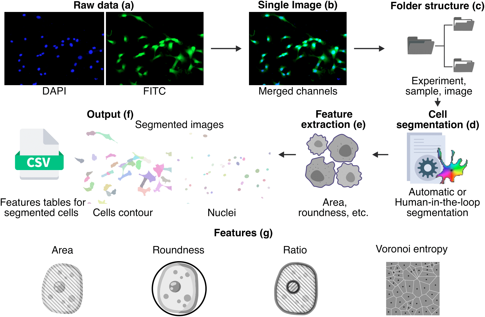

# 
  <b>Cellpose plus</b> 

<!--  -->

<!--  -->
<!--  -->

<!--  -->
<!--  -->

Cellpose plus is a morphological analysis tool that builds on a forked branch of the state-of-the-art image segmentation framework [Cellpose](https://github.com/MouseLand/cellpose). 
We add feature extraction algorithms to asses morphological properties of cells and nuclei. Achieving a single workflow to study stained cells, from raw images to labeled masks with their corresponding measures. 

Developed by the InfoChemistry scientific center, part of ITMO university.

### Metrics

* Area of subject (𝜇𝑚2).
* Roundness (0.0 - 1.0), having 1.0 for a perfect circle.
* Size ratio between each pair of cell and nucleus.
* Fraction of image covered by cells/nuclei.
* Relative center coordinates.
* Voronoi diagram.
* Voronoi entropy.
* Continuous symmetry measure (CSM). 

### Workflow

<!--  -->

In order to obtain metrics from segmented cells, the initial stained images are merged into a
single image and organized into sub folders to be processed. A cell segmentation
procedure is performed using [Cellpose](https://github.com/MouseLand/cellpose), then we extract metrics 
and finally we store results in the form of images and CSV files.

### Try out online!

You can run Cellpose plus in google colab with a GPU: 
* We provide a commented code-based example notebook:  showing each part of our workflow.

### Installation

We suggest installing our fork using conda and pip (with >=python3.8).

1. Install [Anaconda](https://www.anaconda.com/download/).
2. Open an anaconda prompt / command prompt which has conda for python 3 in the path.
3. For a new environment for CPU only, run:\
 `conda create -n cellpose_plus 'python==3.9' pytorch` \
 For NVIDIA GPUs, add these additional arguments:\
 `torchvision pytorch-cuda=11.8 -c pytorch -c nvidia`\
4. To activate the new environment, run `conda activate cellpose_plus`
5. To install the latest PyPi release of Cellpose plus, run:\
  `pip install cellpose-plus[gui]`\
  or `pip install cellpose-plus` for a version without GUI.
### How to use

Maybe to attach a link to the manual we wrote, if possible

<!--  -->

### Citation

Here to add the DOI or direct link of the paper

As we work over Cellpose, we ask you to also cite the Cellpose [paper](https://t.co/kBMXmPp3Yn?amp=1).